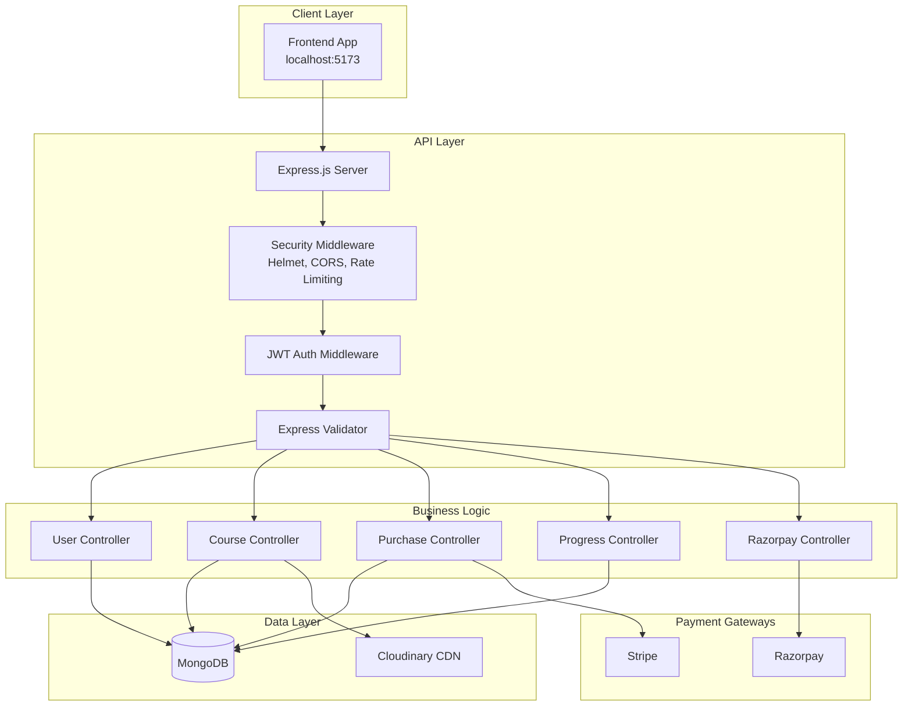
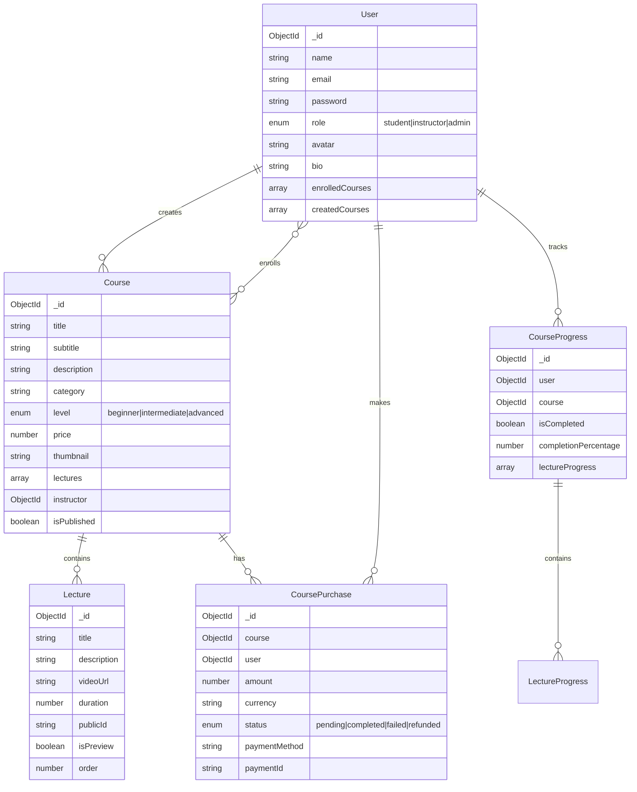
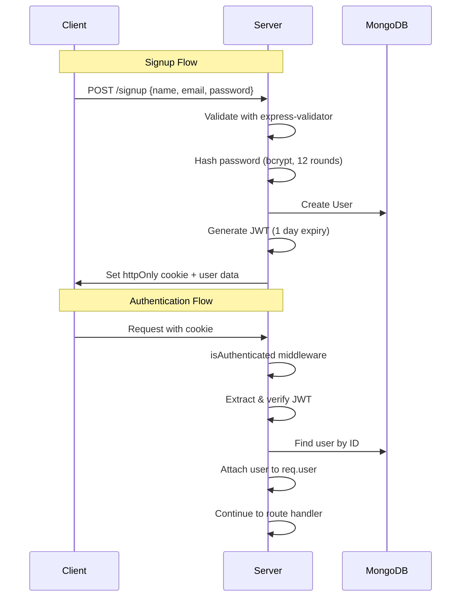

# Backend Architecture Overview

This document provides a comprehensive architectural analysis of the `server-solution` backend codebase — an **e-learning/LMS (Learning Management System) platform**.

---

## High-Level Architecture

---

## Folder Structure

| Directory | Purpose |
|-----------|---------|
| [`controllers/`](file:///Users/harshamarnani/Developer/server-solution/controllers) | Business logic handlers for each route |
| [`routes/`](file:///Users/harshamarnani/Developer/server-solution/routes) | Express route definitions grouped by feature |
| [`models/`](file:///Users/harshamarnani/Developer/server-solution/models) | Mongoose schemas and data models |
| [`middleware/`](file:///Users/harshamarnani/Developer/server-solution/middleware) | Auth, error handling, and validation middleware |
| [`utils/`](file:///Users/harshamarnani/Developer/server-solution/utils) | Utility functions (Cloudinary, JWT, Multer) |
| [`database/`](file:///Users/harshamarnani/Developer/server-solution/database) | MongoDB connection with retry logic |
| `uploads/` | Temporary file storage before Cloudinary upload |

---

## Data Models

---

## API Endpoints

### Authentication & User Management
| Method | Endpoint | Auth | Description |
|--------|----------|------|-------------|
| `POST` | `/api/v1/user/signup` | ❌ | Create new account |
| `POST` | `/api/v1/user/signin` | ❌ | Login and get JWT cookie |
| `POST` | `/api/v1/user/signout` | ❌ | Clear auth cookie |
| `GET` | `/api/v1/user/profile` | ✅ | Get current user profile |
| `PATCH` | `/api/v1/user/profile` | ✅ | Update profile (with avatar upload) |
| `PATCH` | `/api/v1/user/change-password` | ✅ | Change password |
| `DELETE` | `/api/v1/user/account` | ✅ | Delete account |

### Course Management
| Method | Endpoint | Auth | Role | Description |
|--------|----------|------|------|-------------|
| `GET` | `/api/v1/course/published` | ❌ | — | List published courses (paginated) |
| `GET` | `/api/v1/course/search` | ❌ | — | Search courses with filters |
| `POST` | `/api/v1/course` | ✅ | instructor | Create new course |
| `GET` | `/api/v1/course` | ✅ | instructor | Get my created courses |
| `GET` | `/api/v1/course/c/:courseId` | ✅ | — | Get course details |
| `PATCH` | `/api/v1/course/c/:courseId` | ✅ | instructor | Update course |
| `GET` | `/api/v1/course/c/:courseId/lectures` | ✅ | — | Get lectures (preview-only for non-enrolled) |
| `POST` | `/api/v1/course/c/:courseId/lectures` | ✅ | instructor | Add lecture with video |

### Course Purchase & Payments
| Method | Endpoint | Auth | Description |
|--------|----------|------|-------------|
| `POST` | `/api/v1/purchase/checkout/create-checkout-session` | ✅ | Create Stripe checkout session |
| `POST` | `/api/v1/purchase/webhook` | ❌ | Stripe webhook handler |
| `GET` | `/api/v1/purchase/course/:courseId/detail-with-status` | ✅ | Get course with purchase status |
| `GET` | `/api/v1/purchase` | ✅ | Get all purchased courses |
| `POST` | `/api/v1/razorpay/create-order` | ✅ | Create Razorpay order |
| `POST` | `/api/v1/razorpay/verify-payment` | ✅ | Verify Razorpay payment |

### Course Progress
| Method | Endpoint | Auth | Description |
|--------|----------|------|-------------|
| `GET` | `/api/v1/progress/:courseId` | ✅ | Get progress for a course |
| `PATCH` | `/api/v1/progress/:courseId/lectures/:lectureId` | ✅ | Mark lecture as complete |
| `PATCH` | `/api/v1/progress/:courseId/complete` | ✅ | Mark entire course complete |
| `PATCH` | `/api/v1/progress/:courseId/reset` | ✅ | Reset course progress |

### Media & Health
| Method | Endpoint | Auth | Description |
|--------|----------|------|-------------|
| `POST` | `/api/v1/media/upload-video` | ❌ | Upload video to Cloudinary |
| `GET` | `/health` | ❌ | Server & database health check |

---

## Authentication & Security Flow

### Security Measures
| Layer | Implementation |
|-------|----------------|
| **Headers** | Helmet.js for security headers |
| **Rate Limiting** | 100 requests per 15 minutes per IP |
| **Body Parsing** | JSON body limit of 10KB |
| **XSS Protection** | xss-clean middleware (commented out) |
| **NoSQL Injection** | express-mongo-sanitize (commented out) |
| **Parameter Pollution** | hpp middleware |
| **CORS** | Configured for specific client URL |
| **Password** | bcrypt with 12 salt rounds, min 8 chars |
| **JWT Cookie** | httpOnly, sameSite=strict, 1 day expiry |
| **Role-based Access** | `restrictTo()` middleware for instructors/admins |

---

## Business Logic Boundaries

### User Domain
- Account lifecycle (signup → profile management → account deletion)
- Password management with reset token flow (email sending TODO)
- Avatar upload to Cloudinary
- Tracks enrolled and created courses

### Course Domain  
- Instructors create/update courses with thumbnails
- Courses have multiple lectures with video content
- Publishing workflow (courses start unpublished)
- Search with category, level, and price filters
- Non-enrolled users only see preview lectures

### Purchase Domain
- Dual payment gateway: **Stripe** (webhook-based) and **Razorpay** (signature verification)
- Purchase records track status: pending → completed → refunded
- 30-day refund window enforced
- Successful purchase enrolls user and unlocks lectures

### Progress Domain
- Per-lecture completion tracking with watch time
- Automatic completion percentage calculation
- Course completion status derived from lectures

---

## Key Assumptions Made by Backend

> [!IMPORTANT]
> These are design assumptions embedded in the current implementation.

| Area | Assumption |
|------|------------|
| **Currency** | All Stripe transactions in **INR** (Indian Rupees) |
| **Shipping** | Stripe checkout limited to **India only** |
| **Single Instructor** | Each course has exactly one instructor |
| **No Reviews** | `averageRating` is hardcoded to 0 (placeholder) |
| **Video Storage** | All videos uploaded to Cloudinary (no streaming service) |
| **File Limits** | 10KB JSON body, 5MB file upload |
| **Session** | Stateless JWT auth with 1-day expiry |
| **Preview Access** | Non-enrolled users see only `isPreview: true` lectures |
| **No Email Service** | Password reset token generated but not sent |
| **Mongo Connection** | 3 retry attempts with 5-second intervals |
| **Role Defaults** | New users default to `student` role |

---

## Main Features Supported

1. **User Authentication** — JWT-based signup/signin with role-based access
2. **Course Creation** — Instructors can create courses with thumbnails and video lectures
3. **Course Discovery** — Public search and browsing of published courses
4. **Course Purchase** — Stripe and Razorpay payment integration
5. **Progress Tracking** — Per-lecture completion with percentage calculation
6. **Media Management** — Cloudinary integration for images and videos
7. **Health Monitoring** — Endpoint exposing database and server status

---

## Tech Stack Summary

| Component | Technology |
|-----------|------------|
| Runtime | Node.js with ES Modules |
| Framework | Express.js v5 (beta) |
| Database | MongoDB with Mongoose ODM |
| Authentication | JWT + httpOnly cookies |
| Validation | express-validator |
| File Upload | Multer → Cloudinary |
| Payments | Stripe + Razorpay |
| Security | Helmet, CORS, Rate Limiting, HPP |
