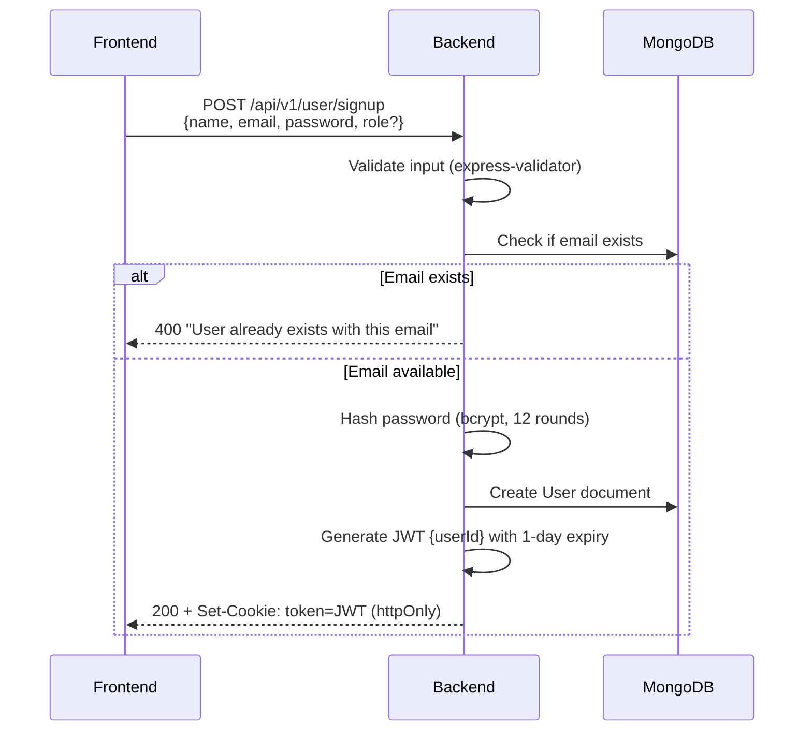
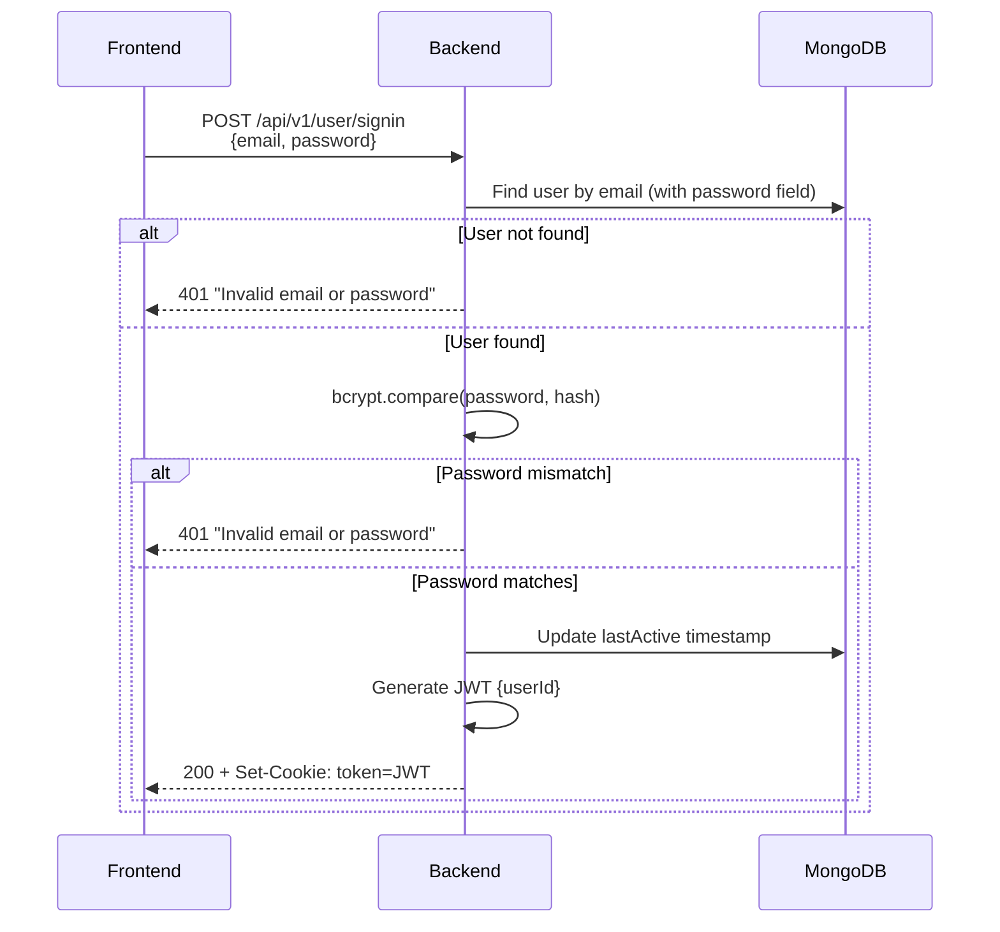
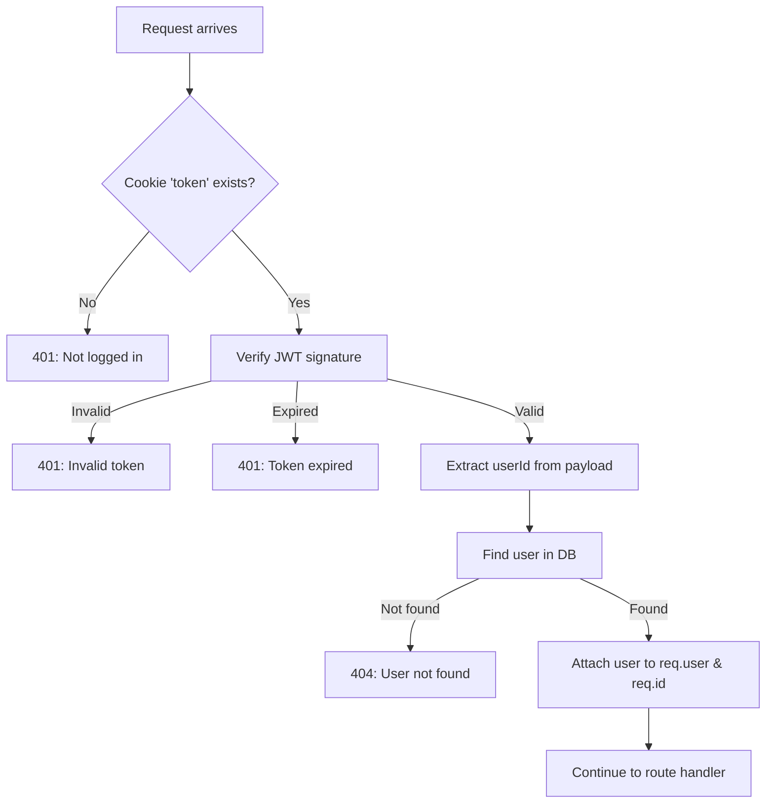
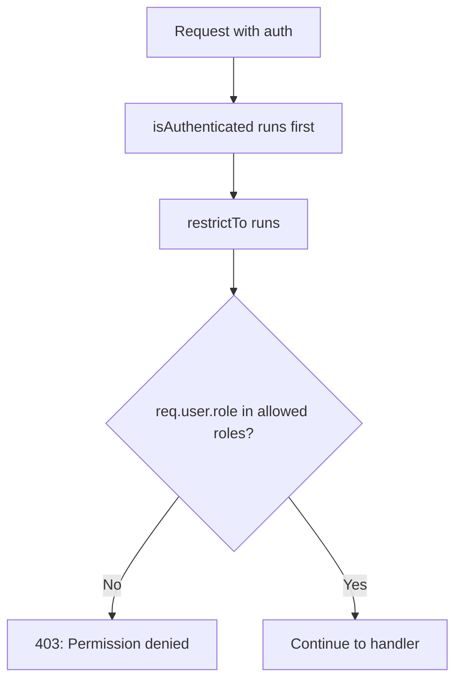
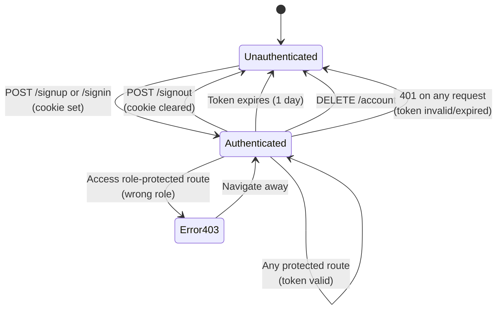

# Authentication & Authorization Flow

A complete breakdown of how this backend handles authentication, sessions, and access control.

---

## 1. Login Mechanism

### Signup Flow



**Password Requirements (validated on frontend AND backend):**
- Minimum 8 characters
- At least one uppercase letter
- At least one lowercase letter  
- At least one number
- At least one special character (`!@#$%^&*`)

### Signin Flow



> **Security Note:** The error message is intentionally vague ("Invalid email or password") to prevent user enumeration attacks.

---

## 2. Token & Session Handling

### JWT Structure

| Field | Value |
|-------|-------|
| Payload | `{ userId: ObjectId }` |
| Secret | `process.env.JWT_SECRET` |
| Expiry | 1 day (`1d`) |
| Algorithm | Default (HS256) |

### Cookie Configuration

```javascript
{
  httpOnly: true,      // Not accessible via JavaScript
  sameSite: "strict",  // Only sent to same-origin requests
  maxAge: 86400000     // 1 day in milliseconds
}
```

| Property | Security Benefit |
|----------|------------------|
| `httpOnly` | Prevents XSS attacks from stealing tokens |
| `sameSite: strict` | Prevents CSRF attacks |
| No `secure` flag | ⚠️ Cookie sent over HTTP in dev (should be `true` in production) |

### Token Validation (`isAuthenticated` middleware)



### Signout Flow

```javascript
// Simply clears the cookie
res.cookie("token", "", { maxAge: 0 });
```

> **Note:** There's no server-side token invalidation (no blacklist). The token remains valid until expiry if intercepted.

---

## 3. Role-Based Access Control (RBAC)

### Available Roles

| Role | Description | Default |
|------|-------------|---------|
| `student` | Can browse, purchase, and track progress | ✅ Yes |
| `instructor` | Can create and manage courses | ❌ No |
| `admin` | Full access (not implemented in routes) | ❌ No |

### `restrictTo` Middleware

```javascript
// Usage: restrictTo("instructor")
// Checks req.user.role against allowed roles
```



### Role-Protected Endpoints

| Endpoint | Required Role | Purpose |
|----------|---------------|---------|
| `POST /api/v1/course` | `instructor` | Create course |
| `GET /api/v1/course` | `instructor` | List own courses |
| `PATCH /api/v1/course/c/:id` | `instructor` (owner) | Update course |
| `POST /api/v1/course/c/:id/lectures` | `instructor` (owner) | Add lecture |

> **Ownership Check:** For course updates, the code also verifies `course.instructor === req.id` beyond just the role.

---

## 4. Protected vs Public Routes

### Public Routes (No Auth Required)

| Method | Endpoint | Purpose |
|--------|----------|---------|
| POST | `/api/v1/user/signup` | Create account |
| POST | `/api/v1/user/signin` | Login |
| POST | `/api/v1/user/signout` | Logout |
| GET | `/api/v1/course/published` | Browse courses |
| GET | `/api/v1/course/search` | Search courses |
| POST | `/api/v1/media/upload-video` | Upload media |
| POST | `/api/v1/purchase/webhook` | Stripe webhook |
| GET | `/health` | Health check |

### Protected Routes (Auth Required)

All other endpoints require the `isAuthenticated` middleware, meaning:
- Valid JWT must be present in cookie
- User must exist in database

### Route Protection Pattern

```javascript
// In course.route.js
router.get("/published", getPublishedCourses);  // Public
router.get("/search", searchCourses);            // Public

router.use(isAuthenticated);  // ⬅️ All routes below are protected

router.post("/", restrictTo("instructor"), createNewCourse);
router.get("/", restrictTo("instructor"), getMyCreatedCourses);
```

---

## 5. Edge Cases Frontend Must Handle

### Token Expiry

| Scenario | Backend Response | Frontend Action |
|----------|------------------|-----------------|
| Expired JWT | `401: Your token has expired. Please log in again.` | Clear local state, redirect to login |
| Invalid JWT | `401: Invalid token. Please log in again.` | Clear local state, redirect to login |

### Session Management

| Scenario | How to Detect | Frontend Action |
|----------|---------------|-----------------|
| User deleted account elsewhere | 404 on any auth request | Clear state, show "Account not found" |
| User logged out elsewhere | Cookie cleared won't apply across tabs | Check auth on tab focus |

### Permission Errors

| Code | Meaning | Frontend Action |
|------|---------|-----------------|
| 401 | Not authenticated | Redirect to login |
| 403 | Authenticated but not authorized | Show "Access denied" or hide UI element |

### Cookie Handling

| Issue | Cause | Solution |
|-------|-------|----------|
| Cookie not sent | CORS misconfiguration | Ensure `credentials: 'include'` in fetch |
| Cookie not set | Different domain | Use same domain or proxy |
| Cookie lost on refresh | Not `httpOnly` issue | Check browser dev tools |

**Required Frontend Fetch Configuration:**
```javascript
fetch('/api/v1/user/profile', {
  method: 'GET',
  credentials: 'include'  // ⬅️ Required to send/receive cookies
});
```

### Rate Limiting

| Scenario | Response | Frontend Action |
|----------|----------|-----------------|
| Too many requests | `429` with message | Show "Too many requests, try again later" |

---

## 6. Security Considerations

### Current Protections

| Layer | Protection |
|-------|------------|
| Password Storage | bcrypt (12 rounds) |
| Token Storage | httpOnly cookie |
| CSRF | sameSite: strict |
| XSS | httpOnly (partial) |
| Headers | Helmet.js |
| Rate Limit | 100 req/15min per IP |

### Potential Gaps

| Gap | Risk | Mitigation |
|-----|------|------------|
| No token blacklist | Can't revoke stolen tokens | Tokens expire in 1 day |
| No `secure` flag on cookie | Tokens sent over HTTP | Add in production |
| `mongoSanitize` commented out | NoSQL injection possible | Uncomment in production |
| `xss-clean` commented out | XSS in stored data | Uncomment in production |
| No refresh token | User re-authenticates daily | Implement refresh token flow |

---

## Flow Diagram: Complete Auth Lifecycle


